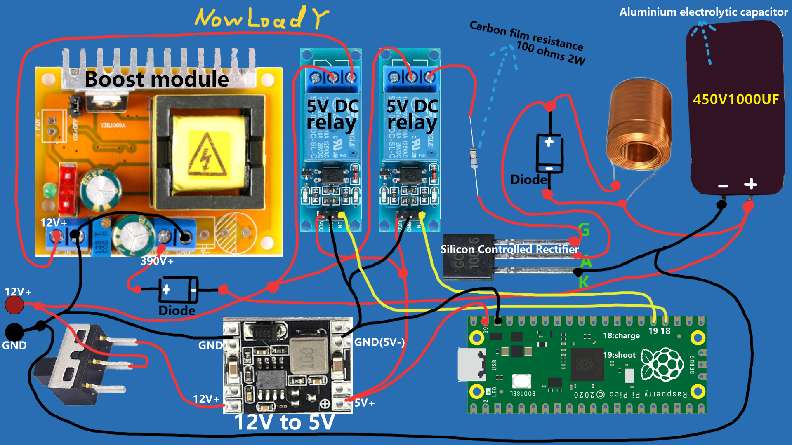

# ECT
Electromagnetic Cannon Turret(Toy model)  
 GPL-3.0 license  
   
<div align="center">
    
</div>  
  
# How To Build Your *ECT*:  
## Circuit  
I recommend that you build your basic circuit according to: first. .  
## 3D print  
The model files required for 3D printing are in [here](https://github.com/NowLoadY/ECT/tree/main/stl_Files)。
## Code  
[Here](https://github.com/NowLoadY/ECT/tree/main/codes)  
### For PC  
#### Install
* It is recommended to use conda to create a virtual environment for you to run Yolov7. Refer to [requirements.txt](https://github.com/WongKinYiu/yolov7/blob/main/requirements.txt)。
* Alternatively, the environment configuration can also be specifically referenced: [yolov7 official instructions](https://github.com/WongKinYiu/yolov7#installation)。  
#### Run
* Under codes/ path, run:
```bash
python elecshooterPC.py
```
Make sure your computer supports serial communication and has a camera connected.  
### For RasPi Pico  
#### Install
* download[.uf2 file](https://www.raspberrypi.org/documentation/pico/getting-started/static/5d8e777377e8dbe23cf36360d6efc727/pico_micropython_20210121.uf2) from [Official website](https://pico.org.cn/)，Follow the official tutorial to install MicroPython.
* Use [Thonny](https://thonny.org/) to connect with Pico
* Download codes/elecshooterPico.py and partsPico.py to Pico.
* If you want it to run automatically when powered on, you need to change the name of elecshooterPico.py to main.py.
#### Run  
* It is usually chosen to run automatically when powered on, otherwise it will become troublesome.  
* Make sure you have connected the Pico to the servo-gimbal and the serial communication module. If you have a buzzer in hand, don't forget it.  
### More Details
check [instructions.md](https://github.com/NowLoadY/ECT/blob/main/codes/instructions.md) 
## Test
<div align="center">
    
</div>  
  
## Reference：  
### Environment configuration related：  
* [查看cuda版本与torch的对应关系](https://blog.csdn.net/JohnJim0/article/details/108688964)  
* [Windows查看自己的cuda版本](https://cloud.tencent.com/developer/article/2031512)  
* [Pycharm中python导入cv2包没有代码提示问题](https://blog.csdn.net/fangzhihuaa/article/details/113903689?spm=1001.2101.3001.6650.1&utm_medium=distribute.pc_relevant.none-task-blog-2~default~CTRLIST~default-1-113903689-blog-122422778.pc_relevant_default&depth_1-utm_source=distribute.pc_relevant.none-task-blog-2~default~CTRLIST~default-1-113903689-blog-122422778.pc_relevant_default&utm_relevant_index=2)
### Data processing related：
* [总结PID算法，位置式增量式理解以及C代码实现](https://blog.csdn.net/weixin_43193231/article/details/95194946)  
### Circuit related
“单级电磁炮可控硅版——电磁爱好”
## Related Repositories  
[yolov7](https://github.com/WongKinYiu/yolov7)  
[Toward Fast, Flexible, and Robust Low-Light Image Enhancement, CVPR 2022](https://github.com/vis-opt-group/SCI)  
